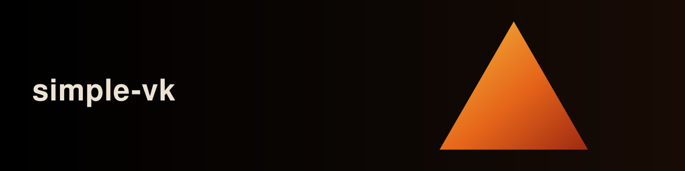

# simple-vk

<p align="center">
  
</p>

[](LICENSE)
[](https://github.com/nihalantiir/simple-vk/releases)
[](https://github.com/nihalantiir/simple-vk/actions/workflows/ci.yml)
[](#prerequisites)
[](#stack)

A clean, minimal, cross-platform Vulkan boilerplate for C++20 projects on
Windows and Linux. A window, an instance/device, a swapchain, a Vulkan 1.3
dynamic-rendering pipeline drawing a triangle, and a Dear ImGui debug
overlay. Copy it as a starting point for real projects.

## Stack

- **C++20**
- **SDL3**, windowing, input, surface creation
- **Volk**, Vulkan function loading
- **VMA** (Vulkan Memory Allocator), GPU memory allocation
- **GLM**, math
- **Dear ImGui**, debug overlay (vendored, see [Libraries](https://github.com/nihalantiir/simple-vk/wiki/Libraries))

SDL3/volk/VMA/GLM ship inside the Vulkan SDK, so there's nothing to fetch or
vendor for those four.

## Prerequisites

- [Vulkan SDK](https://vulkan.lunarg.com/) installed, with `VULKAN_SDK` set
- CMake >= 3.24 and [Ninja](https://ninja-build.org/)
- A C++20 compiler (MSVC, Clang, or GCC)
- Internet access on first configure (Dear ImGui is fetched via CMake)

## Building

```
./scripts/build.ps1 [Debug|Release|RelWithDebInfo]   # Windows
./scripts/build.sh [Debug|Release|RelWithDebInfo]    # Linux
```

Or with [CMake presets](CMakePresets.json): `cmake --preset debug && cmake --build --preset debug`.

The executable, `SDL3.dll` (Windows), and compiled shaders all land in `build/bin/`.

## Cleaning

```
./scripts/clean.ps1   # Windows
./scripts/clean.sh    # Linux
```

## Project structure

```
simple-vk/
├── CMakeLists.txt
├── CMakePresets.json
├── CHANGELOG.md
├── external/            vendored deps (Dear ImGui, fetched by CMake)
├── scripts/             build/clean helpers for both platforms
├── shaders/             GLSL sources, compiled to SPIR-V at build time
├── assets/              reserved for future runtime content
├── .github/workflows/   CI (configure + build on Windows and Linux)
└── src/
    ├── main.cpp
    ├── core/            Vulkan + SDL bootstrap: Window, VulkanContext, Swapchain, ShaderModule, ...
    ├── renderer/        the frame loop and pipeline: Renderer
    ├── debug/           Dear ImGui overlay: DebugUi
    └── game/            your game/engine logic goes here
```

`core/` stays generic, `renderer/` builds on it to draw, `debug/` overlays
introspection on top, `game/` is where application logic lives. See
[Architecture](https://github.com/nihalantiir/simple-vk/wiki/Architecture).

## Documentation

Deeper docs live on the [wiki](https://github.com/nihalantiir/simple-vk/wiki):

- [Home](https://github.com/nihalantiir/simple-vk/wiki)
- [Build](https://github.com/nihalantiir/simple-vk/wiki/Build)
- [Architecture](https://github.com/nihalantiir/simple-vk/wiki/Architecture)
- [Vulkan bootstrap](https://github.com/nihalantiir/simple-vk/wiki/Vulkan-bootstrap)
- [Rendering](https://github.com/nihalantiir/simple-vk/wiki/Rendering)
- [Shaders](https://github.com/nihalantiir/simple-vk/wiki/Shaders)
- [Libraries](https://github.com/nihalantiir/simple-vk/wiki/Libraries)
- [Extending](https://github.com/nihalantiir/simple-vk/wiki/Extending)
- [Coding conventions](https://github.com/nihalantiir/simple-vk/wiki/Coding-conventions)
- [Troubleshooting](https://github.com/nihalantiir/simple-vk/wiki/Troubleshooting)

## License

MIT, see [LICENSE](LICENSE).
